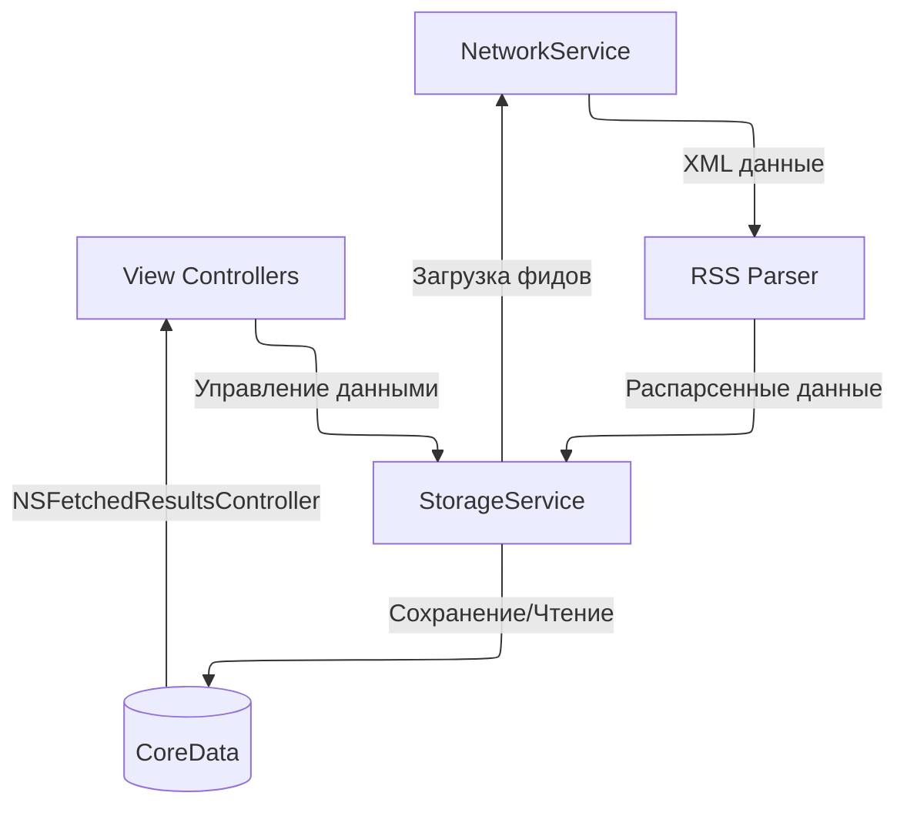
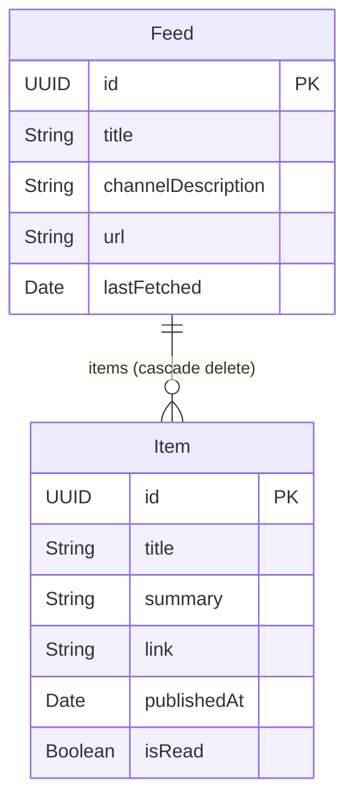

# UIKit RSS Viewer

Проект позволяет сохранять и просматривать RSS каналы.

## Возможности

- Добавление RSS каналов по URL
- Автоматическое обновление лент
- Просмотр новостей из всех каналов
- Отметки о прочтении новостей
- Удаление каналов

## TODO

1. Добавить методы для управления пометками о прочтении.
2. Добавить закладки.
3. Добавить поддержку изображений в ленте.

## Архитектура

### Общая структура

### Слои приложения

**View Controllers**
- `FeedListViewController` - список RSS каналов
- `RSSListViewController` - лента новостей из всех каналов

**Services**
- `StorageService` - управление CoreData, парсинг RSS
- `NetworkService` - загрузка данных по URL

### Хранение данных

Данные хранятся в двух таблицах CoreData:

**Feed** - RSS канал
- `id` - уникальный идентификатор
- `title` - название канала
- `channelDescription` - описание канала
- `url` - URL RSS фида
- `lastFetched` - время последнего обновления
- `items` - связь с новостями (cascade delete)

**Item** - новость из RSS канала
- `id` - уникальный идентификатор
- `title` - заголовок новости
- `summary` - краткое описание
- `link` - ссылка на полную версию
- `publishedAt` - дата публикации
- `isRead` - флаг прочтения
- `feed` - связь с каналом

## Технологии

- UIKit
- CoreData + NSFetchedResultsController
- XMLParser для RSS
- URLSession для сетевых запросов
